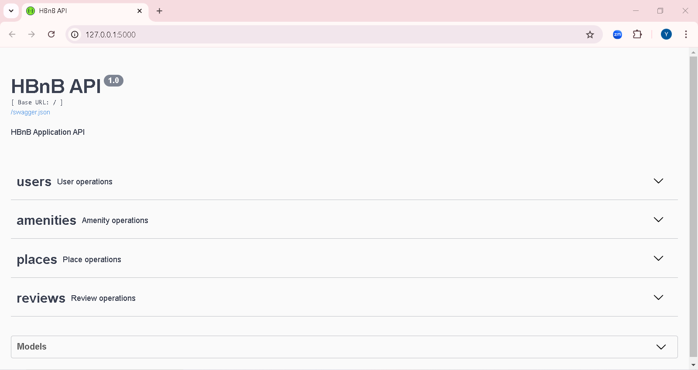

**Part 2: Implementation of Business Logic and API Endpoints**

### Description

In this phase of the HBnB project, we implement the core functionality of the application using Python and Flask. This involves creating the presentation and business logic layers, as well as defining essential classes, methods, and API endpoints, based on the design developed in the previous part.

### Objectif

The goal is to bring the documented architecture to life by creating the project structure, develop the business logic, and implement key functionality such as managing users, places, reviews, and amenities.

### Explanation:

- The `app/` directory contains the core application code.
- The `api/` subdirectory houses the API endpoints, organized by version (`v1/`).
- The `models/` subdirectory contains the business logic classes (e.g., `user.py`, `place.py`).
- The `services/` subdirectory is where the Facade pattern is implemented, managing the interaction between layers.
- The `persistence/` subdirectory is where the in-memory repository is implemented. This will later be replaced by a database-backed solution using SQL Alchemy.
- `run.py` is the entry point for running the Flask application.
- `config.py` will be used for configuring environment variables and application settings.
- `requirements.txt` will list all the Python packages needed for the project.


## **COMPILATION**
```
python3 run.py
```




## Install requirements
```
pip install -r requirements.txt
```

## **AUTHORS**

#### [Yanis MEFTOUH](https://github.com/yanis59100):
<8845@holbertonstudents.com>

#### [Binbin HE](https://github.com/yanis59100):
<8755@holbertonstudents.com>

#### [Xavier Sanchez](https://github.com/binbinher):
<9552@holbertonstudents.com>
